# Карта экранов и маршрутов

Полный перечень адресов интерфейса: какой файл ТЗ описывает экран, кому он открыт и откуда на него попадают; схема переходов по ролям и навигация каркаса (рейл и панели разделов) под каждой ролью. Правило: в ТЗ нет экрана, которого нет в приложении, и наоборот.

Связанные разделы: роли, стартовые экраны и доступ к адресам — [../01-product/users-and-roles.md](../01-product/users-and-roles.md) (§1, §6); каркас, гейт входа и экраны ошибок — [shell.md](shell.md); сквозные сценарии — [../02-business-logic/end-to-end-scenarios.md](../02-business-logic/end-to-end-scenarios.md).

## Сводка

- В карте маршрутов приложения **41 адрес**: 6 вне каркаса (`/`, `/login`, `/reset-password`, `/welcome`, `/register`, `/fill/$token`) и 35 внутри рабочего каркаса; из них 3 — переадресации (`/` → `/home`, `/owner` → `/owner/costs`, `/catalog/budget-positions` → `/budget`). Любой другой адрес — экран «Такой страницы нет» (404).
- Параметры пути пишутся как в карте маршрутов: `$id`, `$token`. Вкладки экранов, как правило, — состояние страницы или параметр запроса (`?tab=`), а не отдельные адреса.
- Условные адреса: `/welcome` существует только при флаге сборки `VITE_LEADS=1`; `/demo` и `/tenders/dense-gate` — служебные экраны демонстрации/отладки (см. примечания в таблице).
- Доступ к адресу интерфейс решает **по роли** ([users-and-roles.md §6](../01-product/users-and-roles.md#6-доступ-к-адресам-интерфейса)): чужой адрес мгновенно уводит на стартовый экран роли; адрес, неизвестный карте, открыт сотрудникам и закрыт контрагенту, лиду и владельцу площадки. Права матрицы проверяет сервер.

Обозначения ролей: **А** — администратор, **С** — тендерный специалист, **СБ** — служба безопасности, **Ю** — юрист, **К** — контрагент (пользователь ЛК), **Л** — лид, **В** — владелец площадки; «публичный» — без входа.

## Таблица маршрутов

### Вне каркаса

| Маршрут | Файл ТЗ | Экран | Роли | Откуда попадают |
|---|---|---|---|---|
| `/` | — (переадресация) | → `/home` | все | Корень сайта; кнопка «На главную» экрана ошибки. Дальше гейт уводит на стартовый экран роли |
| `/login` | [login.md](login.md) | Вход (email → пароль, MFA, первый пароль, восстановление) | публичный | Любой адрес за входом без сессии; истёкшая сессия (`?reason=`); «Выйти»; ссылка активации из письма (`?activation_token=&email=`); «Вход» в публичных каркасах |
| `/reset-password` | [reset-password.md](reset-password.md) | Новый пароль по ссылке | публичный | Ссылка из письма восстановления (`?token=`) |
| `/welcome` | [welcome.md](welcome.md) | «Заявка принята» | Л (не-лида уводит на его стартовый экран) | Вход лида; гейт для лида с любого адреса. **Только при `VITE_LEADS=1`** |
| `/register` | [register.md](register.md) | Анкета саморегистрации контрагента (публичный каркас) | публичный, по токену (`?token=`) | Ссылка-приглашение, выданная сотрудником на экране [«Анкеты»](questionnaires.md) или в карточке контрагента |
| `/fill/$token` | [fill.md](fill.md) | Форма КП по приглашению (гостевой или рабочий каркас) | публичный, по токену; оформление — по сессии | Письмо-приглашение, письма раунда/версии ФКП; кабинет контрагента; уведомления (`?item=`); ссылка участника в карточке тендера |
| (любой иной) | [shell.md](shell.md#ошибки-и-служебные-экраны) | «Такой страницы нет» (404) | все | Неверный адрес |

### Внутри рабочего каркаса

| Маршрут | Файл ТЗ | Экран | Роли | Откуда попадают |
|---|---|---|---|---|
| `/home` | [home.md](home.md) | Главная (рабочий стол / очередь проверки) | А, С, СБ, Ю | Стартовый экран сотрудника; рейл «Обзор»; логотип; `/` |
| `/notifications` | [notifications.md](notifications.md) | Уведомления | А, С, СБ, Ю (К → `/cabinet?tab=notifications`) | «Все уведомления» в колокольчике |
| `/chats` | [chats.md](chats.md) | Чаты | А, С, К | «Открыть во весь экран» в панели «Чаты»; у К — пункт «Чаты» панели «Обзор»; уведомления (`?tender_id=&supplier_id=`) |
| `/profile` | [profile.md](profile.md) | Профиль | А, С, СБ, Ю, К, Л (В → `/owner/costs`) | Шапка меню профиля в топбаре |
| `/settings` | [settings.md](settings.md) | Настройки (у сотрудников — системные/личные разделы, у К — настройки кабинета) | А, С, СБ, Ю, К | Меню профиля «Настройки»; рейл «Администрирование» (у С и Ю — первый пункт); у К — пункт «Настройки» панели «Обзор»; шестерёнка колокольчика (`?tab=notifications`); принудительная настройка MFA администратора |
| `/tenders` | [tenders-registry.md](tenders-registry.md) | Реестр тендеров | А, С | Рейл «Тендеры» (первый пункт); главная; поиск |
| `/tenders/new` | [tender-create.md](tender-create.md) | Мастер создания тендера | А, С | «Новый тендер» на главной и в реестре; черновики мастера |
| `/tenders/$id` | [tender-card.md](tender-card.md) (+ `tender-card-*.md`) | Карточка тендера | А, С (по грантам на объект) | Реестр, главная, поиск Ctrl K, уведомления, чаты, карточка КП, карточка объекта |
| `/tenders/dense-gate` | [tender-dense-gate.md](tender-dense-gate.md) | Служебный стенд плотной сравнительной таблицы | А, С | Только прямой адрес. С флагом `VITE_DEMO_TOOLS=1` — стенд, без флага — заглушка «Стенд плотной матрицы доступен только в dev/demo/test.». В продукт не входит |
| `/quotes` | [quotes-inbox.md](quotes-inbox.md) | Входящие КП | А, С | Рейл «Тендеры» → «Входящие КП»; главная «Новые КП»; панель «Обзор» |
| `/quotes/$id` | [quote-card.md](quote-card.md) | Карточка КП | А, С | Входящие КП, поиск, карточка тендера, уведомления |
| `/templates` | [templates.md](templates.md) | Шаблоны тендеров | А, С | Рейл «Тендеры» → «Шаблоны»; «Сохранить как шаблон» в карточке тендера |
| `/portfolios` | [portfolios.md](portfolios.md) | Портфели и объекты | А, С | Рейл «Тендеры» → «Портфели и объекты» |
| `/portfolios/objects/$id` | [object-card.md](object-card.md) | Карточка объекта (проекта) | А, С (по грантам) | Дерево портфелей; ссылки на объект в карточке тендера и реестре |
| `/budget` | [budget.md](budget.md) | Бюджет (обзор, позиции, распределение) | А, С | Рейл «Тендеры» → «Бюджет»; манометр бюджета на главной; `/catalog/budget-positions` |
| `/budget/$id` | [budget-position.md](budget-position.md) | Бюджетная позиция | А, С | Позиции бюджета; бюджетная позиция в сводке тендера |
| `/catalog/budget-positions` | [catalog-budget-positions.md](catalog-budget-positions.md) | — (переадресация) | А, С | Старый адрес справочника бюджетных позиций → `/budget` (позиции живут в «Бюджете») |
| `/catalog/work-types` | [catalog-work-types.md](catalog-work-types.md) | Справочник «Виды работ» | А, С | Рейл «Справочники» (первый пункт) |
| `/catalog/units` | [catalog-units.md](catalog-units.md) | Справочник «Единицы измерения» | А, С | Рейл «Справочники» → «Единицы измерения» |
| `/catalog/statuses` | [catalog-statuses.md](catalog-statuses.md) | Справочник «Статусы» | А, С | Рейл «Справочники» → «Статусы» |
| `/reports` | [reports.md](reports.md) | Аналитические отчёты | А, С | Рейл «Справочники» → «Отчёты»; панель «Обзор» |
| `/suppliers` | [suppliers.md](suppliers.md) | Список контрагентов | А, С, СБ, Ю | Рейл «Контрагенты» (первый пункт); главная СБ/юриста; панель «Обзор» |
| `/suppliers/$id` | [supplier-card.md](supplier-card.md) | Карточка контрагента | А, С, СБ, Ю | Список контрагентов, поиск, анкеты, уведомления, досье в сравнении, очереди проверки |
| `/questionnaires` | [questionnaires.md](questionnaires.md) | Анкеты контрагентов (ссылки-приглашения) | А, С | Рейл «Контрагенты» → «Анкеты» |
| `/users` | [users.md](users.md) | Пользователи системы | А | Рейл «Администрирование» (первый пункт у А) |
| `/expenses` | [expenses.md](expenses.md) | Расходы на ИИ | А | Рейл «Администрирование» → «Расходы» (пункт только при `BILLING_ENABLED`; адрес открыт администратору всегда); «Запросить пополнение» в панели ИИ |
| `/security-log` | [security-log.md](security-log.md) | Журнал безопасности (информационная безопасность) | А, СБ | Рейл «Администрирование» → «Журнал безопасности» (у СБ — первый пункт); уведомления об инцидентах |
| `/demo` | [demo.md](demo.md) | Демо-сценарий (чек-лист показа) | А | «Настройки → Демо-сценарий · Открыть» — ссылка видна только при `VITE_DEMO_TOOLS=1`; сам адрес флагом не закрыт (см. [открытые вопросы](../_oq/SCR-1.md)). В продукт не входит |
| `/cabinet` | [cabinet.md](cabinet.md) | Личный кабинет контрагента (`?tab=notifications` / `activity`) | К | Стартовый экран К; панель «Обзор» → «Кабинет»; логотип; крошка формы КП |
| `/owner` | — (переадресация) | → `/owner/costs` | В | Прямой адрес |
| `/owner/clients` | [owner-clients.md](owner-clients.md) | Клиенты (баланс токенов ИИ) | В | Рейл «Владелец» (первый пункт при `BILLING_ENABLED`) |
| `/owner/requests` | [owner-requests.md](owner-requests.md) | Заявки на пополнение | В | Рейл «Владелец» → «Заявки» (при `BILLING_ENABLED`) |
| `/owner/costs` | [owner-costs.md](owner-costs.md) | Себестоимость | В | Стартовый экран владельца; рейл «Владелец» |
| `/owner/calls` | [owner-calls.md](owner-calls.md) | Журнал обращений к ИИ | В | Рейл «Владелец» → «Журнал обращений» |
| `/owner/settings` | [owner-settings.md](owner-settings.md) | Настройки владельца (MFA, курс, реквизиты) | В | Рейл «Владелец» → «Настройки»; «Настройки» в меню профиля владельца; принудительная настройка MFA владельца |

### Параметры адреса, на которые опираются переходы

| Адрес | Параметр | Смысл |
|---|---|---|
| `/login` | `reason`; `activation_token` + `email` | Причина выхода над формой; первый вход по ссылке активации |
| `/reset-password` | `token` | Токен восстановления |
| `/register` | `token` | Токен приглашения на анкету |
| `/fill/$token` | `item` | Прокрутить к позиции |
| `/cabinet` | `tab=notifications` \| `activity` | Вкладка кабинета |
| `/chats` | `tender_id`, `supplier_id` | Открыть/создать диалог пары |
| `/settings` | `tab`, `section` | Раздел настроек ([settings.md](settings.md)) |
| `/tenders/$id` | `p`, `m`, `dev`, `dyn`, `pot`, `sort`, `f`, `slice`, `dossier` | Вид сравнительной таблицы и досье ([tender-card.md](tender-card.md#маршрут)) |

## Схема переходов по ролям

### Вход и стартовые экраны

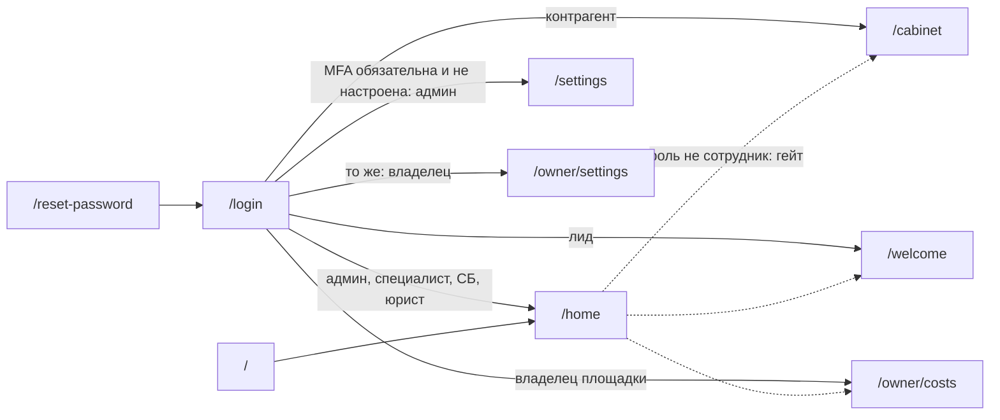
```mermaid
flowchart LR
  L["/login"] -->|админ, специалист, СБ, юрист| H["/home"]
  L -->|контрагент| C["/cabinet"]
  L -->|лид| W["/welcome"]
  L -->|владелец площадки| OC["/owner/costs"]
  L -->|MFA обязательна и не настроена: админ| S["/settings"]
  L -->|то же: владелец| OS["/owner/settings"]
  RP["/reset-password"] --> L
  ROOT["/"] --> H
  H -.->|роль не сотрудник: гейт| C
  H -.-> W
  H -.-> OC
```

### Администратор и тендерный специалист

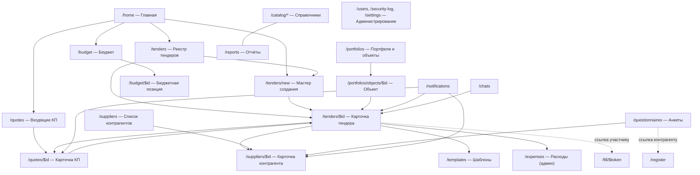
```mermaid
flowchart TD
  H["/home — Главная"] --> TR["/tenders — Реестр тендеров"]
  H --> TN["/tenders/new — Мастер создания"]
  H --> QI["/quotes — Входящие КП"]
  H --> B["/budget — Бюджет"]
  TR --> TN
  TR --> T["/tenders/$id — Карточка тендера"]
  TN --> T
  QI --> Q["/quotes/$id — Карточка КП"]
  Q --> T
  T --> Q
  T --> SC["/suppliers/$id — Карточка контрагента"]
  T --> TPL["/templates — Шаблоны"]
  T --> EX["/expenses — Расходы (админ)"]
  P["/portfolios — Портфели и объекты"] --> O["/portfolios/objects/$id — Объект"] --> T
  B --> BP["/budget/$id — Бюджетная позиция"]
  SL["/suppliers — Список контрагентов"] --> SC
  QN["/questionnaires — Анкеты"] --> SC
  QN -.->|ссылка контрагенту| REG["/register"]
  T -.->|ссылка участнику| FILL["/fill/$token"]
  CAT["/catalog/* — Справочники"] --- RPT["/reports — Отчёты"]
  ADM["/users, /security-log, /settings — Администрирование"]
  N["/notifications"] --> T
  N --> SC
  N --> Q
  CH["/chats"] --> T
```

### Служба безопасности и юрист

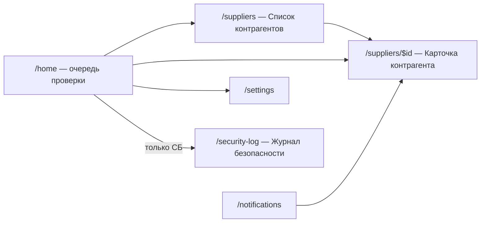
```mermaid
flowchart LR
  H["/home — очередь проверки"] --> SL["/suppliers — Список контрагентов"] --> SC["/suppliers/$id — Карточка контрагента"]
  H --> SC
  N["/notifications"] --> SC
  H --> SET["/settings"]
  H -->|только СБ| LOG["/security-log — Журнал безопасности"]
```

### Контрагент

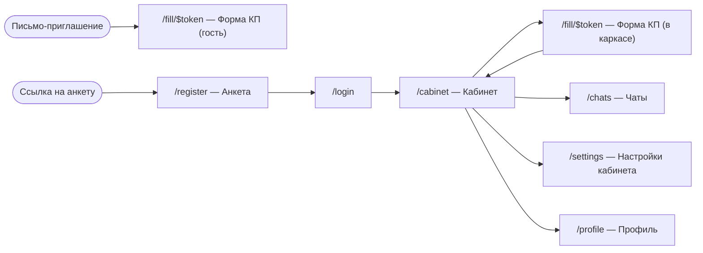
```mermaid
flowchart LR
  Mail(["Письмо-приглашение"]) --> FILL["/fill/$token — Форма КП (гость)"]
  RegLink(["Ссылка на анкету"]) --> REG["/register — Анкета"] --> L["/login"]
  L --> C["/cabinet — Кабинет"]
  C --> FILL2["/fill/$token — Форма КП (в каркасе)"]
  C --> CH["/chats — Чаты"]
  C --> SET["/settings — Настройки кабинета"]
  C --> PR["/profile — Профиль"]
  FILL2 --> C
```

### Владелец площадки

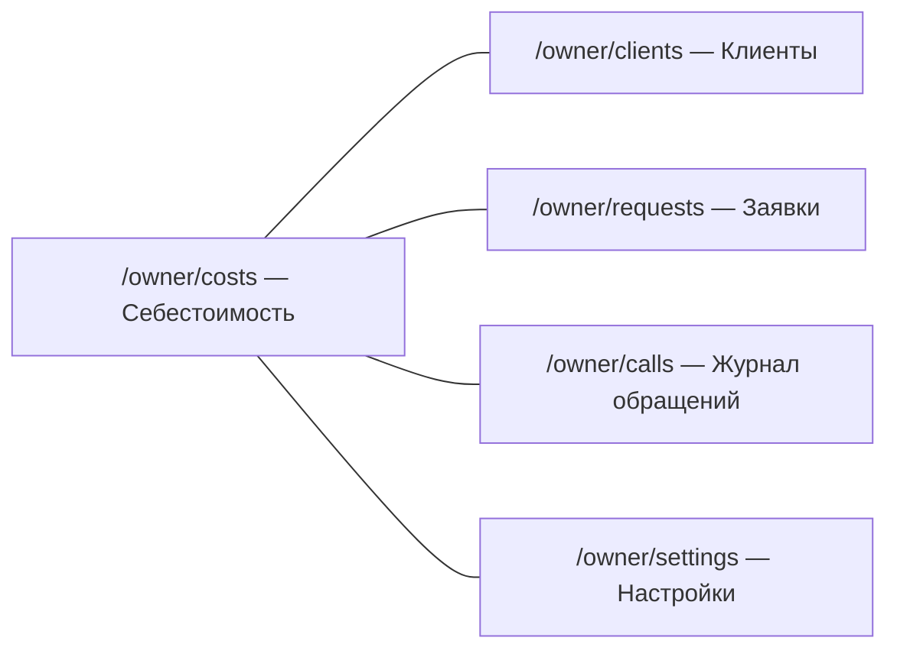
```mermaid
flowchart LR
  OC["/owner/costs — Себестоимость"] --- CL["/owner/clients — Клиенты"]
  OC --- RQ["/owner/requests — Заявки"]
  OC --- CA["/owner/calls — Журнал обращений"]
  OC --- OS["/owner/settings — Настройки"]
```

Лид: `/login` → `/welcome` (любой другой адрес за входом возвращает на `/welcome`).

## Навигация каркаса по ролям

Рейл показывает разделы, открытые роли; клик по разделу ведёт на **первый пункт его дерева для этой роли**; панель раздела (сайдбар) и превью-флайаут показывают пункты дерева. Пункты с пометкой * видны только при `BILLING_ENABLED=true`. «Обзор» у сотрудников — личная полка закреплённых экранов, у контрагента — дерево кабинета ([shell.md](shell.md#панель-обзор--личная-полка-ярлыков)).

| Раздел рейла | Администратор | Тендерный специалист | СБ | Юрист | Контрагент | Владелец |
|---|---|---|---|---|---|---|
| Обзор | `/home`: Закреплённое + Недавние | `/home`: Закреплённое + Недавние | `/home`: закреплённое (по умолчанию «Список контрагентов») | `/home`: то же | `/cabinet`: Кабинет · Чаты · Настройки | — |
| Тендеры | Реестр тендеров · Портфели и объекты · Входящие КП · Шаблоны · Бюджет | то же | — | — | — | — |
| Контрагенты | Список контрагентов · Анкеты | Список контрагентов · Анкеты | Список контрагентов | Список контрагентов | — | — |
| Справочники | Виды работ · Единицы измерения · Статусы · Отчёты | то же | — | — | — | — |
| Администрирование | Пользователи · Расходы* · Журнал безопасности · Настройки | Настройки | Журнал безопасности · Настройки | Настройки | — | — |
| Владелец | — | — | — | — | — | Клиенты* · Заявки* · Себестоимость · Журнал обращений · Настройки |

Топбар по ролям: у всех, кроме владельца, — поиск Ctrl K, чаты, уведомления, меню профиля; у владельца — только логотип и меню профиля (без пункта «Профиль»). Лид каркаса не видит.

### Администратор

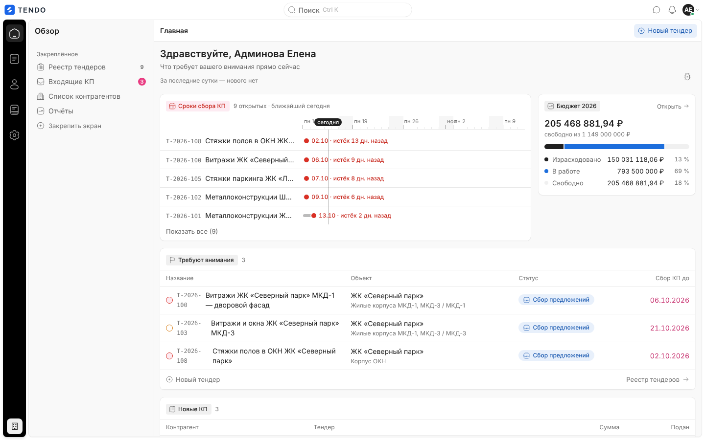

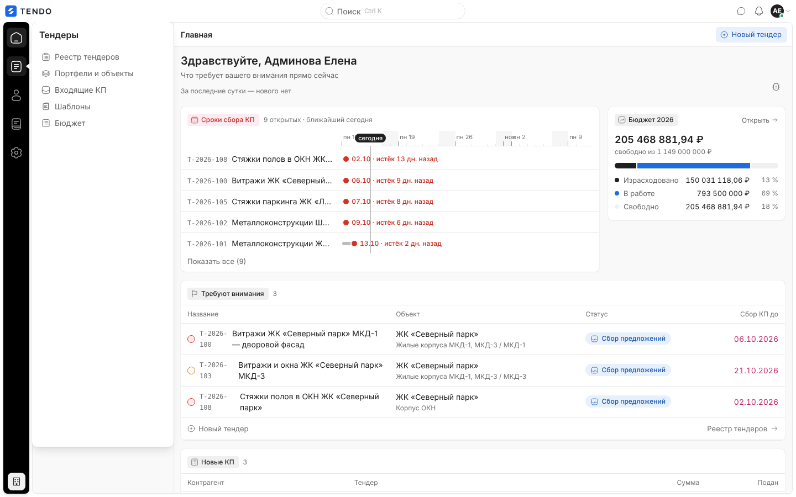 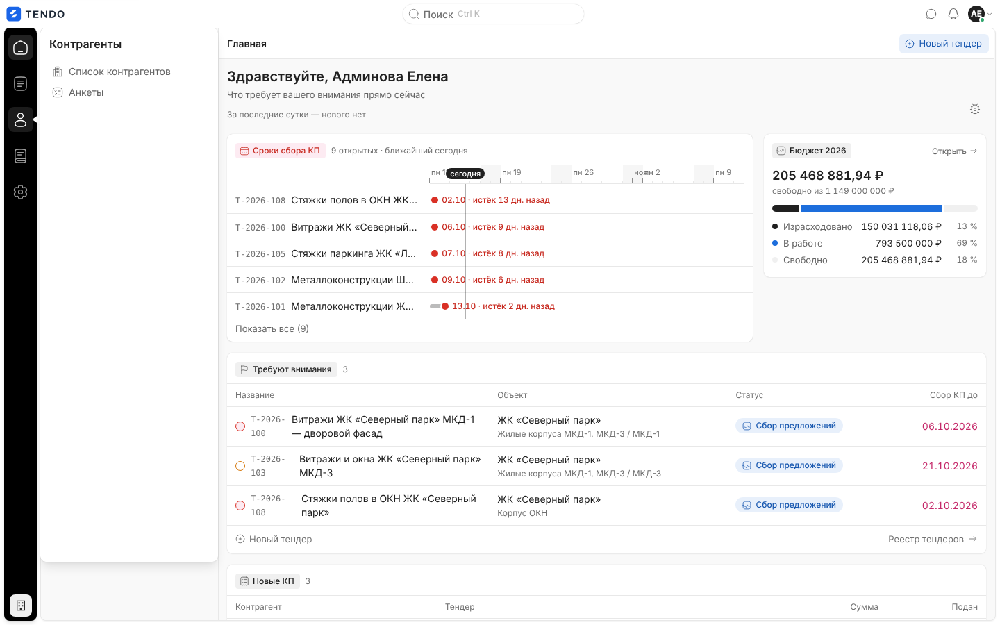

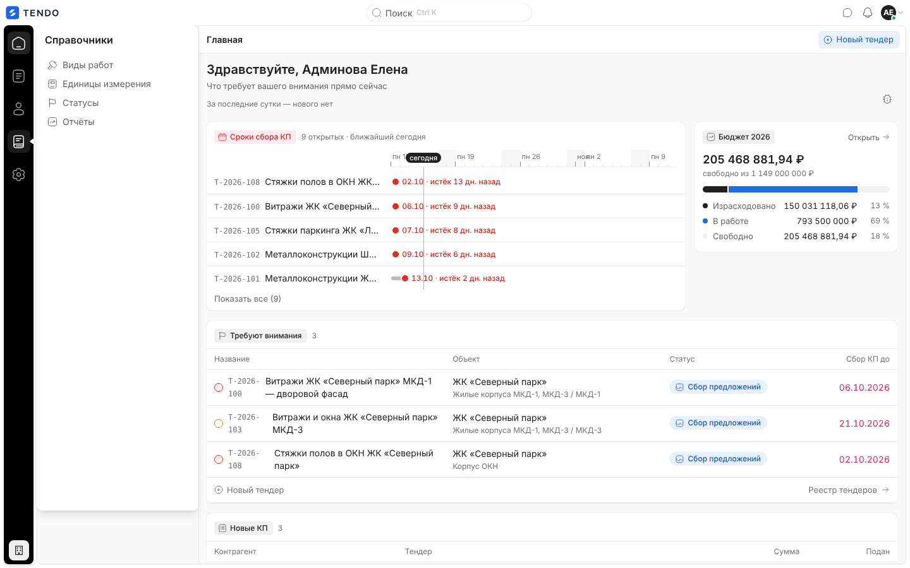 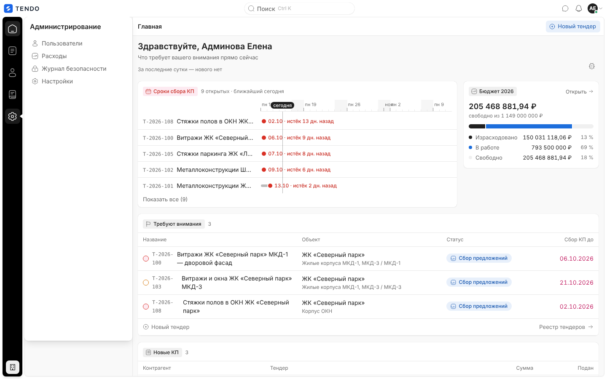

### Тендерный специалист

 

 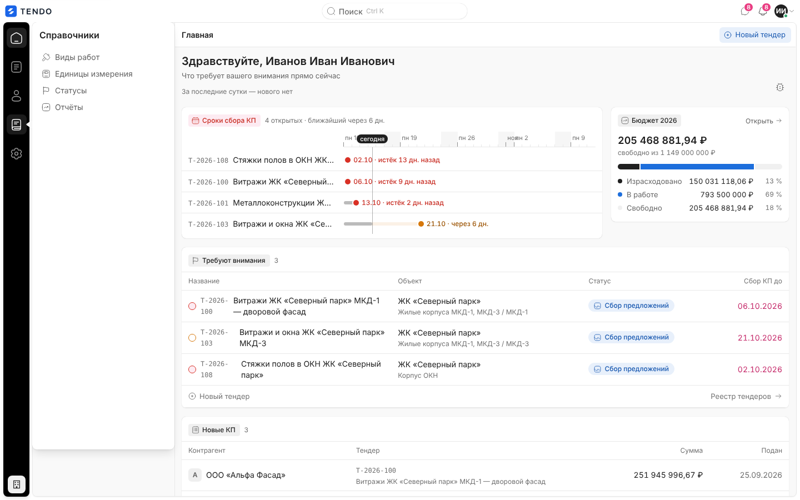

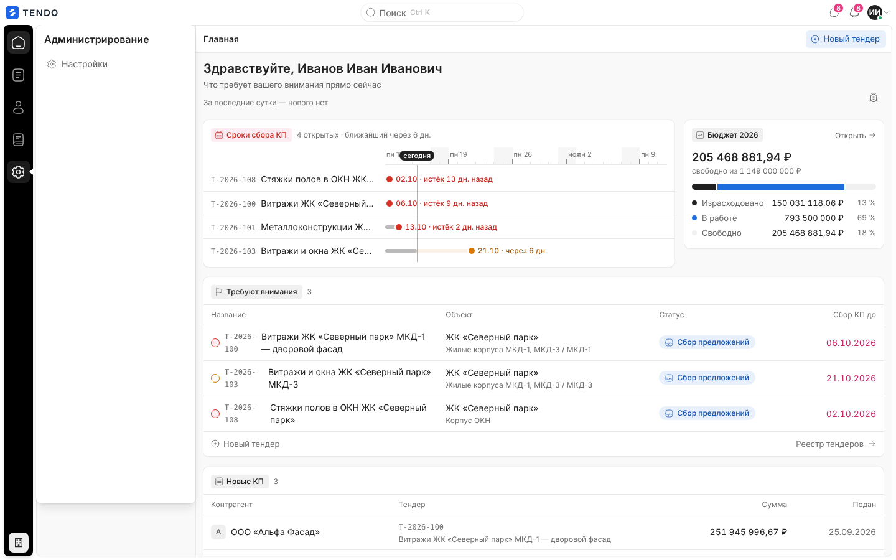

### Служба безопасности

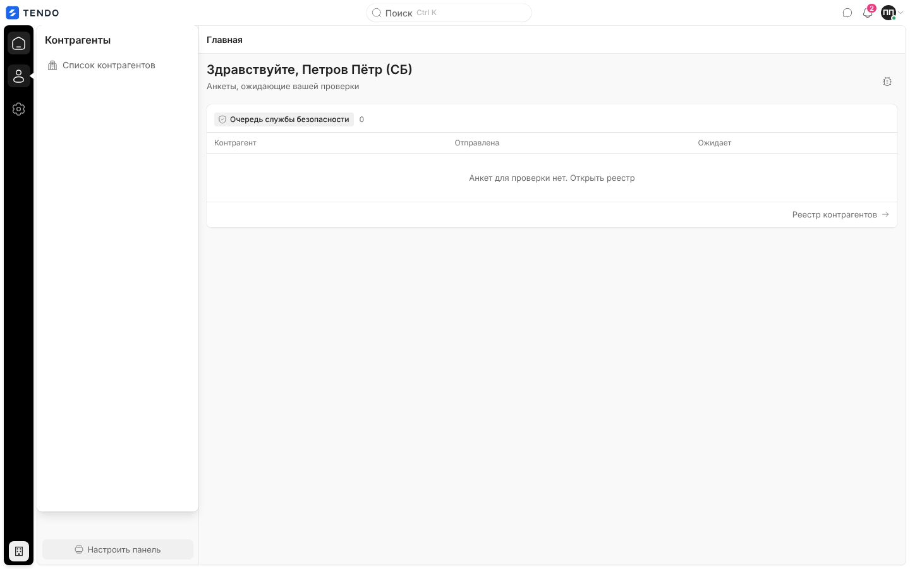 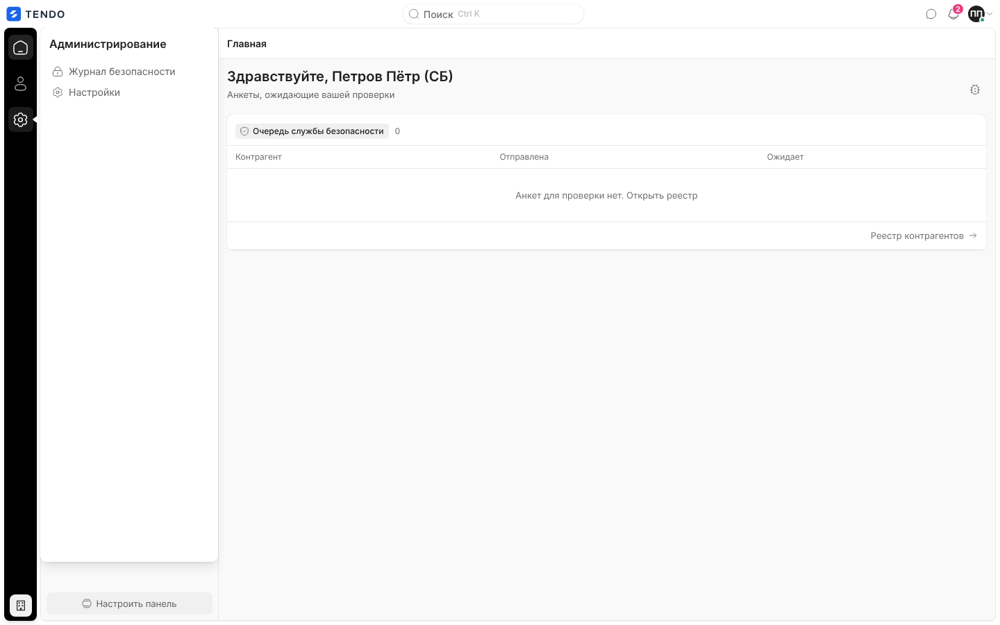

### Юрист

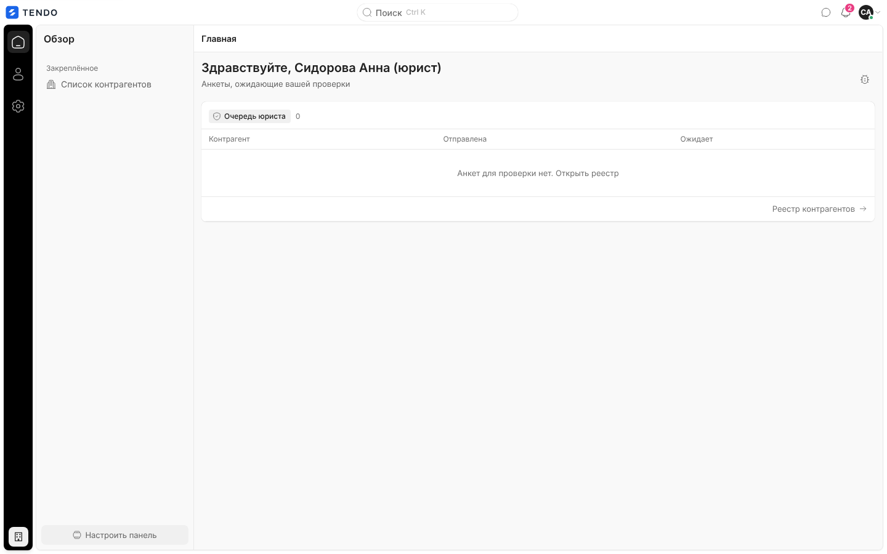

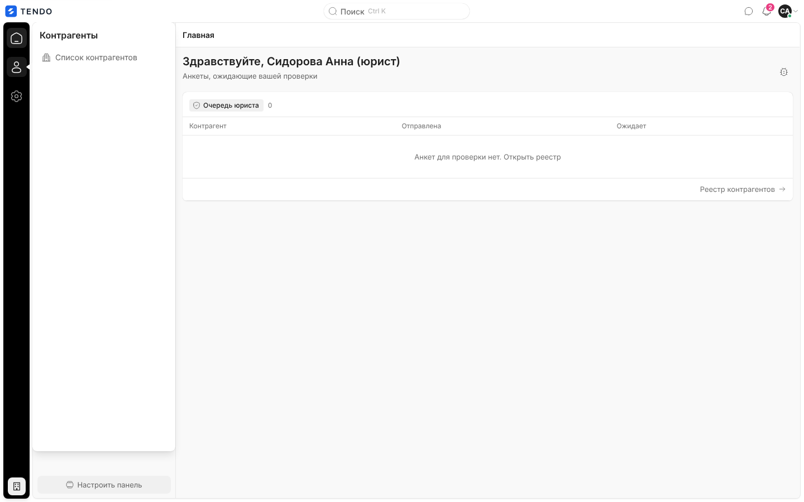 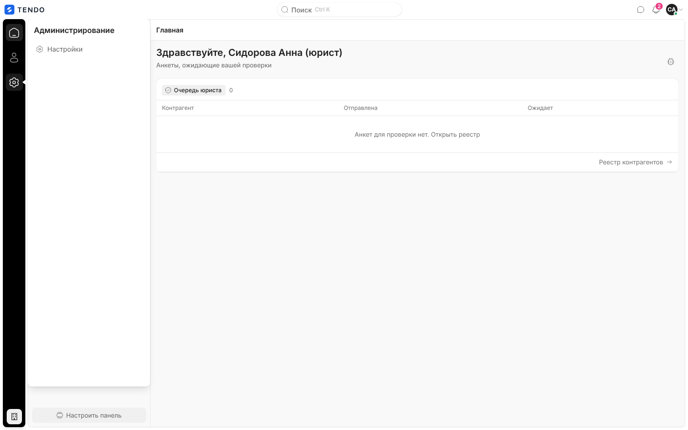

### Контрагент

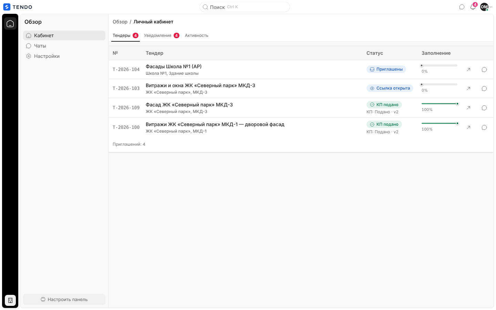

### Владелец площадки

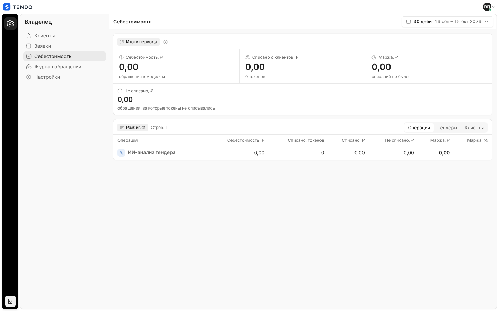

### Лид и гость по ссылке

Лид видит только [welcome.md](welcome.md) без каркаса. Гость по ссылке видит публичные каркасы [register.md](register.md) и [fill.md](fill.md#каркас-гость-и-вошедший): рейл с разделами будущего кабинета под замком.

## Сложность

Маршрутизация, гейт по ролям, переадресации и карта «адрес → раздел рейла» — **S** (сверх каркаса, [shell.md](shell.md)).
